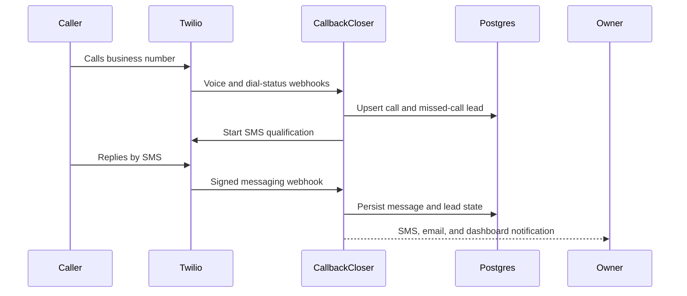

<div align="center">

# CallbackCloser

### Recover the lead before the caller moves on.

**A missed-call recovery system that follows up by SMS, qualifies the request, notifies the business, and keeps the complete conversation in an operator dashboard.**

[Simulator (hosting remediation pending)](https://callbackcloser.com/simulator) · [Review the architecture](docs/ARCHITECTURE.md) · [Work with RelayWorks](https://getrelayworks.com/contact/)

  

</div>

## Business problem

Service businesses often miss calls while a technician is driving, working, or speaking with another customer. CallbackCloser turns that missed call into an immediate, trackable SMS conversation instead of leaving the caller to try a competitor.

## Key features

- Twilio voice webhooks, forwarding, missed-call detection, and recording metadata
- Persisted SMS qualification flow with STOP, START, and HELP compliance handling
- Owner delivery by SMS, optional email, and in-app notification
- Protected lead dashboard with filters, conversation history, and outcome tracking
- Managed Twilio subaccount, messaging-service, and number provisioning
- Clerk authentication, tenant boundaries, and admin operating tools
- Stripe checkout, billing portal, webhook synchronization, and subscription gating
- Idempotent webhook handling, correlation IDs, rate limits, health checks, and alert hooks
- Isolated public simulator for demonstrations without real customer workspaces

## Screenshots and demo

The `/simulator` route is the safest evidence path because it does not send real SMS or modify a customer workspace. The production URL is currently unavailable while its hosting configuration is remediated; run the simulator locally in the meantime. A verified screenshot set is not committed yet; the required views and redaction rules are in [`docs/DEMO.md`](docs/DEMO.md).

## Architecture



Webhook handlers are thin entry points around domain modules in `lib/`. Prisma provides persistence and uniqueness constraints for retry safety. See [`docs/ARCHITECTURE.md`](docs/ARCHITECTURE.md) for trust boundaries and failure behavior.

## Tech stack

- Next.js 14 App Router, React, TypeScript, Tailwind CSS
- Prisma and PostgreSQL
- Clerk authentication
- Twilio Voice and Messaging
- Stripe subscriptions and webhooks
- Resend for optional owner email delivery
- Node test runner through `tsx`

## Installation

Prerequisites: Node.js 20, npm, PostgreSQL, and development accounts for Clerk, Stripe, and Twilio.

```bash
git clone https://github.com/DevCalebR/callbackcloser.git
cd callbackcloser
npm ci
cp .env.example .env.local
```

## Configuration

Fill the blank values in `.env.local`. The minimum local categories are:

- `NEXT_PUBLIC_APP_URL` and `DATABASE_URL`
- Clerk publishable and secret keys
- Stripe secret, webhook secret, and price IDs
- Twilio account credentials and signature validation setting

Optional email, alerting, provider-parity, and carefully scoped demo settings are documented inline in [`.env.example`](.env.example). Validate configuration without printing secrets:

```bash
npm run env:check
```

## Running locally

```bash
npm run db:generate
npx prisma migrate deploy
npm run dev
```

Open `http://localhost:3000`. Use `/simulator` for the self-contained demonstration path. For real webhook testing, expose localhost through a trusted tunnel and configure provider URLs with `npm run webhooks:print`.

## Validation

```bash
npm test
npm run lint
npm run typecheck
npm run build
```

Provider and database checks are intentionally separate because they require live credentials:

```bash
npm run db:smoke
npm run preflight:providers
```

The full database-backed test path requires a configured PostgreSQL `DATABASE_URL`. Lint and typecheck remain available without a live database.

## Deployment

The application is configured for Vercel with managed PostgreSQL. Before live traffic:

1. Set production environment variables and run `npm run env:check`.
2. Deploy migrations with `npm run db:deploy`.
3. Configure Clerk origins and redirect URLs.
4. Configure Stripe and Twilio webhooks against the canonical HTTPS origin.
5. Keep `TWILIO_VALIDATE_SIGNATURE=true`; complete US A2P registration before customer messaging.
6. Run the smoke procedure in [`RUNBOOK.md`](RUNBOOK.md).

Production settings are detailed in [`docs/PRODUCTION_ENV.md`](docs/PRODUCTION_ENV.md) and [`docs/EXTERNAL_SETUP_CHECKLIST.md`](docs/EXTERNAL_SETUP_CHECKLIST.md).

## Project structure

```text
app/                  Public pages, protected workspace, admin, and API routes
components/           Shared interface components
lib/                  Domain logic, provider adapters, security, and observability
prisma/               Schema and versioned migrations
scripts/              Environment, database, webhook, and provider checks
tests/                Domain, security, tenancy, provider, and route validation
docs/                 Architecture and operating runbooks
```

## Design decisions

- Webhook processing is idempotent because providers retry delivery.
- SMS progress is persisted on each lead instead of depending on process memory.
- Production Twilio requests fail closed when signature validation is not configured.
- The simulator is isolated from customer workspaces and real provider side effects.
- Billing gates automation but does not discard an inbound lead.

## Known limitations

- Existing-number onboarding and cross-account number moves remain admin-assisted.
- US long-code SMS requires external A2P brand and campaign approval.
- Local development requires several provider accounts; the simulator is the lightweight evaluation path.
- Background delivery currently runs within application request workflows rather than a dedicated durable queue.
- Live performance and conversion-rate claims are intentionally not made without production customer evidence.

## Roadmap

- Capture a redacted, verified simulator and operator-dashboard walkthrough
- Add durable background jobs if production volume requires them
- Publish measured delivery and recovery outcomes only after a representative pilot

## License

Copyright © 2026 Caleb Rogers. All rights reserved. See [`LICENSE`](LICENSE).

## Work with me

CallbackCloser demonstrates communications automation, provider webhooks, subscription workflows, and operational dashboards. To discuss a similar system, [contact RelayWorks](https://getrelayworks.com/contact/) or review [DevCalebR on GitHub](https://github.com/DevCalebR).
