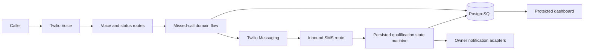

# Architecture

## Core flow

## Application layers

- `app/api/twilio/` and `app/api/stripe/` authenticate provider requests and translate them into domain calls.
- `lib/` owns qualification, idempotency, tenant access, provisioning, notifications, billing, observability, and validation.
- Prisma owns durable records and uniqueness constraints for businesses, calls, leads, messages, subscriptions, and audit events.
- The protected `app/app/` workspace renders business-scoped operational views; `app/admin/` is a separate operator boundary.

## Reliability model

Provider callbacks can be duplicated, delayed, or reordered. Call records are upserted by provider identifiers, a lead is reused for the same call, and SMS start and owner notification timestamps prevent repeated side effects. Production deployments should introduce a durable job queue only when request-bound delivery no longer meets volume or latency needs.

## Trust boundaries

- Clerk establishes user identity; business-access helpers enforce tenant scope.
- Twilio signatures and Stripe webhook signatures authenticate provider events.
- Production demo-mode overrides fail closed unless explicitly enabled.
- Logs are structured and sanitized before leaving the application.
- Recordings and message content are customer data and must not enter fixtures, screenshots, or bug reports.
